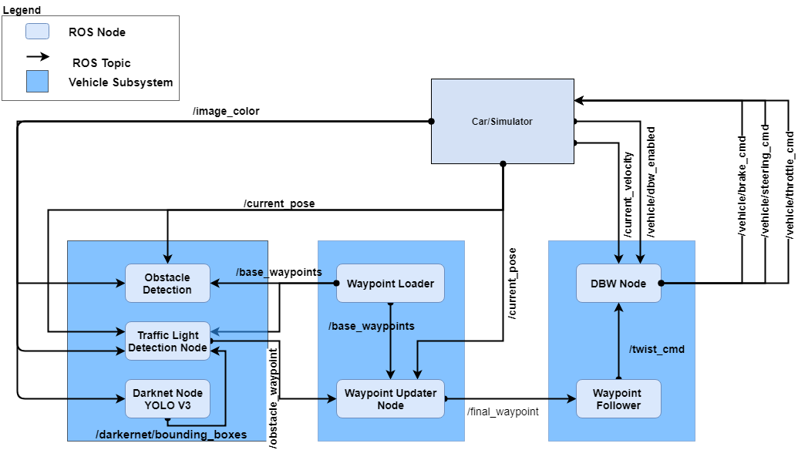
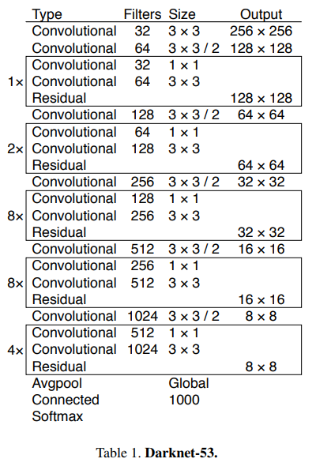

# Run Carla - Udacity Self-Driving Car Capstone

This is the project repo for the final project of the Udacity Self-Driving Car Nanodegree: Programming a Real Self-Driving Car. For more information about the project, see the project introduction.


| RunCarla Team              
|:-----------------
| Shridhar Rasal   
| Arjun Bhasin      
| Swapnil More     
| Manish Ramaswamy 
| Wilson Fong       


## Introduction

In this project, we developed software to drive automously Carla, Udacity autonomous car. The autonomous car is in essence a robot. The project's goal is to provide the robotic car with the ability to plan a route and drive the route. During the drive, the car will drive smootly while detecting traffic lights, react accordingly and to drive within the lanes 


## ROS Architecture

Below is the RunCarla ROS node architecture with the publish and subscribe topics. 



## Planning Subsystem

### Waypoint Node

We implemented two key behaviors in the waypoint node.
1. Generate the next 200 way points.
2. If a red traffic light is ahead, decelerate the car just before the traffic light stop line.

A key responsibility of the Waypoint Node is to publish the next 200 upcoming waypoints ahead of the car. With the waypoints for the track At the start of the simulation, the waypoints for the road are published. Based on the current car position, the Waypoint Node will find the nearest waypoint to the car, and pusblish the 200 wayponts after the closest point. We had to ensure that the point was ahead of the car and not behind the car. 

The other major responsibility address is to respond to red traffic light ahead of the car. Given, the red light detection from the TL_Detector, the Waypoint Node will create waypoints to delecerate the car. This is done below. Based on the stopline point provided by the TL detector, we compute the distance from the closest waypoint to the car to two points before the stopline waypoint. The two points before the stop line gives us a buffer to stop. Essentialy, it computes the distance to the stop location, and compute the velocity based on an empirically determined formula.

**...Need some explanation of the twist.twist.linear.x...**


```
    # Important function
    # Warning: Do not modify the original base_waypoints list (that message comes only once)
    def decelerate_waypoints(self, waypoints, closest_idx):
        temp = []
        for i , wp in enumerate(waypoints):
            p = Waypoint()
            p.pose = wp.pose

            # 2 is subtracted to ensure that the front of the car stops at the stop line
            stop_idx = max(self.stopline_wp_idx - closest_idx - 2, 0)
            # Sum of distance between waypoints (sum of line segments)
            dist = self.distance(waypoints, i, stop_idx)

            # We can experiment with other functions too as this is quite steep 
            vel = math.sqrt(2 * MAX_DECEL * dist)
            if vel < 1.:
                vel = 0

            p.twist.twist.linear.x = min(vel, wp.twist.twist.linear.x)
            temp.append(p)

        return temp
```

Based on the current state, our waypoint generator, generate_lane(), will invoke the appropriate routine, see snippet from this function. 

```

        # If no traffic light was detected, publish the base_waypoints as it is
        if (self.stopline_wp_idx == -1) or (self.stopline_wp_idx >= farthest_idx):
            lane.waypoints = base_waypoints
        else:
            lane.waypoints = self.decelerate_waypoints(base_waypoints, closest_idx)

        return lane
```

Finally, the nodes to /final_waypoints to be used by the DBW Node.


## Control Subsystem

### DBW Node

The DBW node is responsible for generating the commands to control the throttle, brake, and steering for the car to stay on the path set by the waypoints.


Subscribes to the topics /current_velocity, /vehicle/dbw_enabled, /final_waypoints/


The controller implements a PID controler for the throttle.


## Perception Subsystem

The perception subsystem comprises a Darknet ROS Node the Darknet a YOLO Deep Learning CNN, [Darnet](https://pjreddie.com/darknet/yolo/), architecture that is adapted for the ROS system and our TL_Detector Node that contains logic for generating a traffic light waypoint and traffic light state detection (RED, YELLOW, GREEN, UNKNOWN).

### Darknet ROS Node

The [Darknet ROS node](https://github.com/leggedrobotics/darknet_ros/). It is a you look only once, YOLO, approach to build a realtime object detector with 80 classes. It has 53 layers, see below.


Darknet uses several messages. For our use, we updated the Darknet ndoe to subscribe to /image_color (via the config file, ros.yaml), and had the TL_Detector node subscribe to the topic /darknet_ros/bounding_boxes.

The Darknet node houses a YOLO V3 CNN object detector that includes traffic lights["YOLOv3: An Incremental Improvement",Redman,2018](https://arxiv.org/abs/1804.02767). The YOLO node publishes the to the topic the bounding boxes of objects it finds in the image:

A bounding box data structure is:
```
string Class
float64 probability
int64 xmin
int64 ymin
int64 xmax
int64 ymax
```
where 
* Class is a string identifying the class. Our interest is in 'traffic light',
* probability is the confidence the YOLOV3 node has in the the classification,
* xmin, ymin, xmax, ymas are the absolute coordinates of the bounding box around the classified object.


### Traffic Light Detection Node
Traffic Light detection subscribes to the /image_color and /darknet_ros/bounding_boxes topic. When it receives an image in /image_color it processes the image via the callback function TL_Detector::image_cb.

It finds the closest traffic waypoint and if a traffic lights are detected, it determines the signal state of the traffic light using the class TL_Classifier.


With the identified traffic light bounding boxes, the TL_Detector crops the image with the bounding boxes and sends the cropped image to TL_Classifier to determine the color state of the traffic light.

The postion and state of the traffic, TL_Detector  publishes this in the /traffic_waypoint topic to be consumbed by the Waypoint Node. 

### TL_Classifier: Classification of traffic light state

TL_Classifier uses two ways to determine the TL state, 1) by color and 2) by position.

We use the computer vision library, OpenCV2, filter the image for red, yellow and green color pixels. The image is converted from BGF into HSV color system where it is easy to define a colorfilter.


For position, we divide the image into three areas and find the brightness image pixels in the 3 region. The region with the largest number of bright pixels determines the state. The top region is assigned red, the middle, yellow and the bottom, green.

